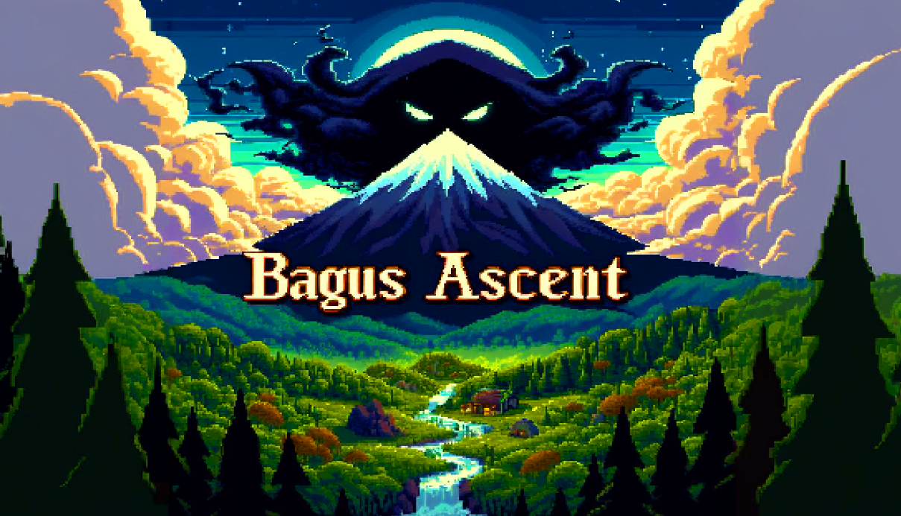
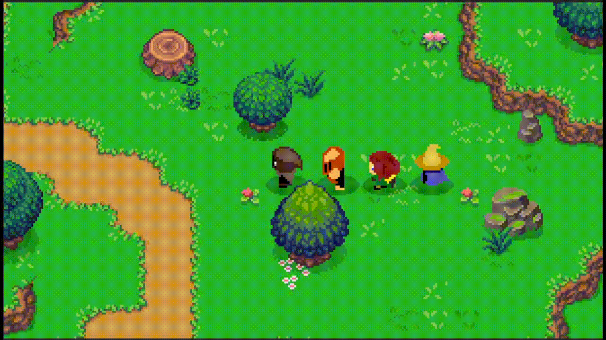
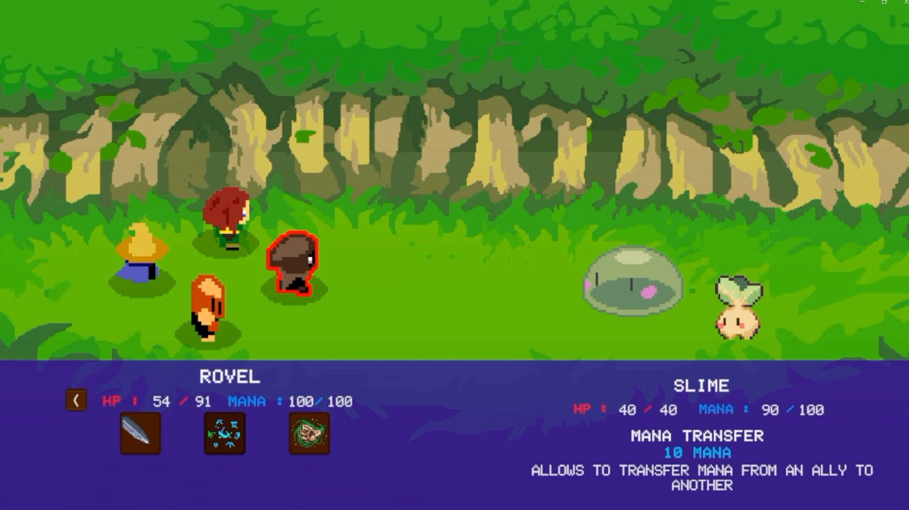
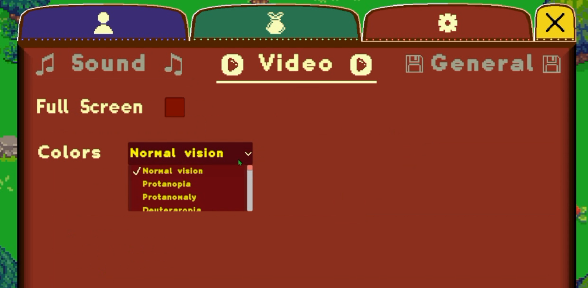
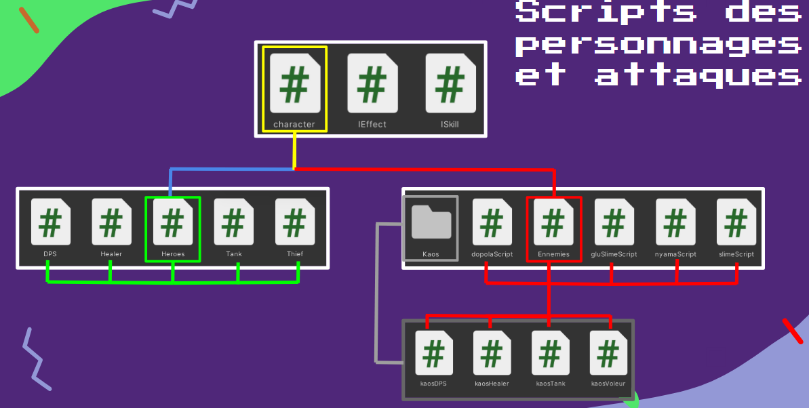
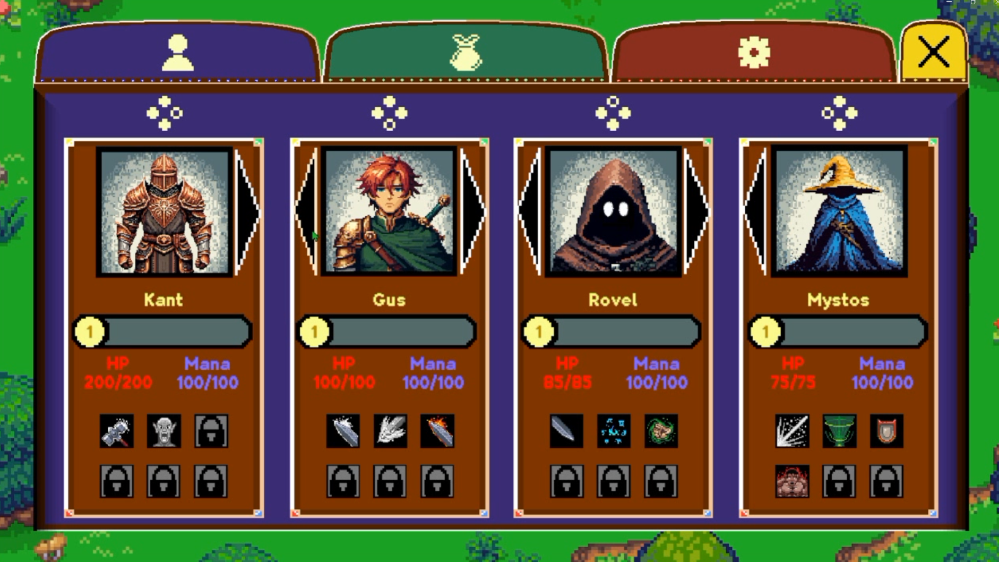

# Bagus Ascent

2D turn-based RPG developed by a team of 4 people in 3 weeks (pre-production + development). The game draws inspiration from Earthbound, Final Fantasy and Pokémon, with particular attention paid to accessibility (colour-blind filters) and eco-friendly code design.

<!-- 
CAPTURE 1 — Banner
-->


---

## 🎮 Overview

**Bagus Ascent** is a 2D turn-based RPG in pixel art style. Each character has unique abilities unlocked by level, with distinct strategic mechanics: turn skip, damage over time, mana drain. The game includes full support for over 10 types of colour blindness through a dynamic colour filter applied in real time.

<!--
CAPTURE 2 — Combat gameplay
-->


---

## 🛠️ My role — Lead developer

I was responsible for:
- The design and implementation of the **turn-based combat system** (turn order, action resolution, damage calculation)
- The **gameplay mechanics**: character abilities, turn skip, damage over time (DoT), mana drain
- The **enemy AI**, based on a finite state machine (FSM) logic
- The **colour-blind accessibility filters** (10+ types supported, applied dynamically)
- **Code eco-optimisation** (reducing unnecessary calls, memory management, asset optimisation)

<!--
CAPTURE 3 — Combat UI
-->


<!--
CAPTURE 4 — Colour-blind filters
-->


---

## ⚙️ Tech stack

| Category | Detail |
|---|---|
| Engine | Unity |
| Language | C# |
| Genre | 2D RPG, turn-based |
| Art style | Pixel art |
| Accessibility | Dynamic colour-blind filters (10+ types) |

---

## 🏗️ Combat system architecture

<!--
CAPTURE 5 — File architecture
-->



---

## 🖼️ Gallery

<!--
CAPTURE 6 — Team menu
-->



---

## 👥 Team

- **Enzo Gonzalez** — Lead developer (combat system, gameplay, AI, accessibility)
- Denis Trimolet
- Raphaël Rifault
- Thibault Stouls

---

## ▶️ Running the project

<!--
Fill in with the actual instructions: Unity version used, steps to open the project, executable build available or not
-->
```bash
# Clone the repo
git clone https://github.com/GONZALEZeDev/BagusAscentProject_SourceCode.git

# Open the project with Unity (version X.X.X)
# Open the main scene: Assets/Scenes/...
```

---

## 🔗 Links

- [Full portfolio](https://enzogonzalez-devportfoiol-websitecode-yibt-9cearzqfb.vercel.app/projects/bagus-ascent)
- [LinkedIn](https://www.linkedin.com/in/enzo-gonzalezdev/)
